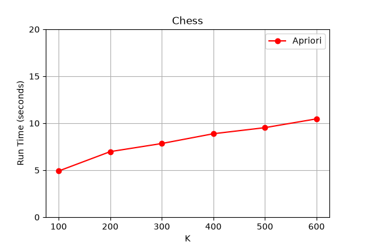
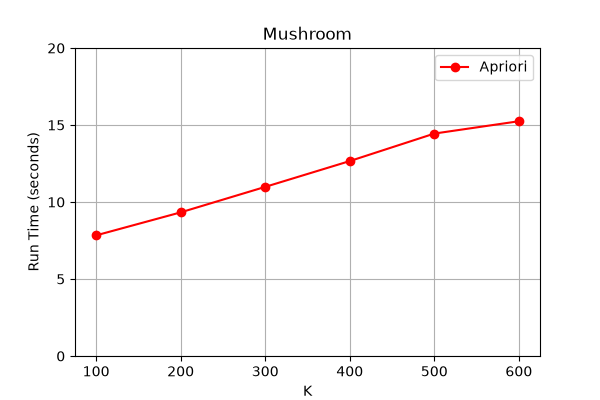
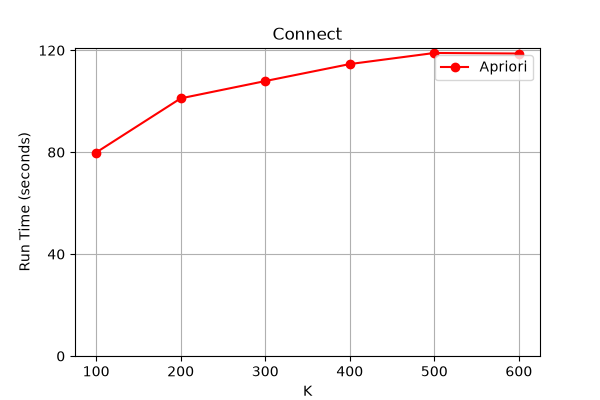

# High-Utility Itemset Mining — AprioriTopK

A Python implementation of the **Apriori Top-K High-Utility Itemset Mining** algorithm. Given a transactional database where each item carries a utility value (e.g., profit), the algorithm discovers the **top-K itemsets** whose combined utility is highest — without needing to exhaustively specify a utility threshold upfront.

---

## Table of Contents

- [Background](#background)
- [Algorithm Overview](#algorithm-overview)
- [Project Structure](#project-structure)
- [Datasets](#datasets)
- [Installation](#installation)
- [Usage](#usage)
- [Data Format](#data-format)
- [Experimental Results](#experimental-results)
- [Testing](#testing)

---

## Background

**High-Utility Itemset Mining (HUIM)** is a data mining task that goes beyond traditional frequent itemset mining by assigning each item a utility (e.g., unit profit, weight, or importance). Rather than simply counting item occurrences, HUIM identifies itemsets that generate the highest *total utility* across transactions.

The **Top-K** variant removes the need to manually tune a minimum utility threshold — instead, you specify how many top patterns (`K`) you want to find. The algorithm maintains a min-heap of the best K itemsets found so far and dynamically raises the internal utility threshold to prune unpromising candidates early.

---

## Algorithm Overview

The core algorithm (`AprioriTopK`) follows a **level-wise Apriori** approach adapted for the Top-K HUIM setting:

1. **Phase 1 — TWU Pruning (1-itemsets)**
   - Compute the *Transaction Weighted Utility (TWU)* for each individual item: sum of all transaction utilities in which the item appears.
   - Discard any item whose TWU is below the current `min_utility` threshold.

2. **Phase 2 — Candidate Generation & Evaluation (k ≥ 2)**
   - Generate candidate itemsets of size `k` by joining frequent itemsets of size `k-1`.
   - For each candidate, compute its actual utility by scanning all transactions that contain all items of the candidate.
   - Keep only candidates whose utility meets `min_utility`.

3. **Phase 3 — Top-K Maintenance**
   - Each qualifying itemset is pushed into a min-heap of size K.
   - When the heap is full, the minimum utility in the heap becomes the new `min_utility`, progressively pruning weaker candidates.

4. **Output**
   - Return the top-K itemsets sorted by utility in descending order.

### Key Parameters

| Parameter | Description |
|-----------|-------------|
| `k` | Number of top-K patterns to return |
| `min_utility` (`m`) | Initial minimum utility threshold (raised dynamically) |

---

## Project Structure

```
High-Utility-Itemset-Mining/
│
├── main.py                  # Entry point — runs experiments across multiple K values
├── test_algorithm.py        # Basic correctness test for AprioriTopK
├── requirements.txt         # Python dependencies
│
├── src/
│   ├── algorithm.py         # AprioriTopK algorithm implementation
│   ├── io_utils.py          # Dataset loading utilities
│   └── visualization.py     # Runtime plotting with matplotlib
│
├── data/
│   ├── chess.txt            # Chess dataset (~660 KB)
│   ├── mushroom.txt         # Mushroom dataset (~1.1 MB)
│   └── connect.txt          # Connect dataset (~17 MB)
│
└── outputs/
    ├── Chess.png            # Runtime chart — Chess dataset
    ├── Mushroom.png         # Runtime chart — Mushroom dataset
    └── Connect.png          # Runtime chart — Connect dataset
```

### Module Descriptions

| File | Description |
|------|-------------|
| `src/algorithm.py` | Core `AprioriTopK` class with `run_algorithm()`, `_generate_candidates()`, and `_save_itemset_to_queue()` methods |
| `src/io_utils.py` | `load_transactions()` — parses the SPMF-format transaction files into `(items, utilities, transaction_utility)` tuples |
| `src/visualization.py` | `plot_runtime()` — plots K vs. runtime line charts using matplotlib |
| `main.py` | Orchestrates experiments: runs the algorithm for K ∈ {100, 200, 300, 400, 500, 600} and plots results |
| `test_algorithm.py` | Standalone test that verifies result ordering and size constraints |

---

## Datasets

Three benchmark datasets from the [SPMF library](https://www.philippe-fournier-viger.com/spmf/index.php?link=datasets.php) are included in the `data/` directory:

| Dataset | File | Transactions | Items | Size |
|---------|------|-------------|-------|------|
| Chess | `chess.txt` | 3,196 | 75 | ~660 KB |
| Mushroom | `mushroom.txt` | 8,124 | 119 | ~1.1 MB |
| Connect | `connect.txt` | 67,557 | 129 | ~17 MB |

Default minimum utility thresholds used in experiments:

| Dataset | `min_utility` |
|---------|--------------|
| Chess | 60,000 |
| Mushroom | 80,000 |
| Connect | 1,350,000 |

---

## Installation

### Prerequisites

- Python 3.8 or higher

### Steps

1. **Clone the repository**

   ```bash
   git clone https://github.com/khnguyen04/High-Utility-Itemset-Mining.git
   cd High-Utility-Itemset-Mining
   ```

2. **Create and activate a virtual environment** (recommended)

   ```bash
   # Windows
   python -m venv venv
   venv\Scripts\activate

   # macOS / Linux
   python -m venv venv
   source venv/bin/activate
   ```

3. **Install dependencies**

   ```bash
   pip install -r requirements.txt
   ```

---

## Usage

### Run an experiment on a dataset

```bash
python main.py --dataset <dataset_name>
```

Available datasets: `chess`, `mushroom`, `connect`

**Example:**

```bash
python main.py --dataset chess
```

This runs the AprioriTopK algorithm for K ∈ {100, 200, 300, 400, 500, 600} on the Chess dataset and displays a runtime chart.

### CLI Options

| Option | Description | Default |
|--------|-------------|---------|
| `--dataset` | Dataset to run (`chess`, `mushroom`, `connect`) | `chess` |
| `--save-fig` | Save the runtime chart as a PNG to `outputs/` | `False` |
| `--no-show` | Do not display the chart interactively | `False` |

**Save the figure without displaying it:**

```bash
python main.py --dataset mushroom --save-fig --no-show
```

**Display and save the figure:**

```bash
python main.py --dataset connect --save-fig
```

### Use the algorithm programmatically

```python
from src.algorithm import AprioriTopK

# Find top-100 itemsets with initial min_utility of 60000
algo = AprioriTopK(k=100, m=60000)
results = algo.run_algorithm("data/chess.txt")

for utility, itemset in results:
    print(f"Utility: {utility} | Itemset: {itemset}")
```

---

## Data Format

The input files follow the **SPMF utility dataset format**:

```
<items> : <transaction_utility> : <item_utilities>
```

Each line represents one transaction:

- **`<items>`** — space-separated item IDs
- **`<transaction_utility>`** — total utility of the transaction
- **`<item_utilities>`** — space-separated utility of each item (in the same order as `<items>`)

**Example:**

```
3 5 1 2 4 6:30:1 3 5 10 6 5
3 5 2 4:20:3 3 8 6
3 1 4:8:1 5 2
```

Lines starting with `#`, `%`, or `@` are treated as comments and skipped.

---

## Experimental Results

The algorithm was benchmarked on all three datasets with K values ranging from 100 to 600. Runtime grows gradually as K increases because a larger K lowers the dynamic threshold, allowing more candidates to survive pruning.

### Chess Dataset (min_utility = 60,000)



### Mushroom Dataset (min_utility = 80,000)



### Connect Dataset (min_utility = 1,350,000)



> **Note:** The Connect dataset is significantly larger (~17 MB, 67K transactions), so runtimes are considerably higher (~80–120 seconds) compared to Chess (~5–11 seconds) and Mushroom (~8–16 seconds).

---

## Testing

A basic correctness test is provided in `test_algorithm.py`. It verifies that:

- Results are sorted in **descending order of utility**
- The number of results does **not exceed K**

### Run with Python directly

```bash
python test_algorithm.py
```

Expected output:
```
[(utility1, itemset1), (utility2, itemset2), ...]
OK
```

### Run with pytest

```bash
pip install pytest
pytest test_algorithm.py -v
```
